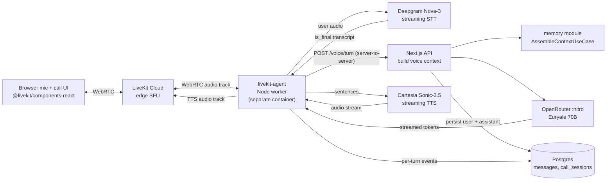

# Voice Call Feature — Implementation Plan

> **Status: SHIPPED 2026-07-30; refined 2026-07-31 (Option C unified composer + per-turn refresh).** This document was the working plan that guided the initial build. It's preserved here as the canonical record of what was designed, why, and how it maps onto the actual code that landed. Follow-up refinements from the first day of dogfooding are documented in [§12 Post-launch refinements](#12-post-launch-refinements-2026-07-31) — don't retrofit them into §1-§11; the change history is more useful legible. For as-implemented configuration values, see [voice-call-architecture.md §9a](voice-call-architecture.md#9a-selected-configuration-as-implemented). For deep provider-selection research, see the rest of that same document.

## 1. Finalized stack (locked)

- **Transport:** LiveKit Cloud (WebRTC SFU, edge PoPs, free 10K min/mo tier)
- **STT:** Deepgram Nova-3 streaming (endpointing tuned to 200 ms)
- **LLM:** `sao10k/l3.1-euryale-70b:nitro` via OpenRouter (fallback `sao10k/l3.3-euryale-70b:nitro`)
- **TTS:** Cartesia Sonic-3.5 (inline `[laugh]` / `[sigh]` markers)
- **Prompt composer:** new `TemplateVoicePromptComposer` (sibling of the existing chat composer)

Unit cost ~$0.045/min, target end-to-end latency 550-1100 ms.

Deep landscape research lives in [voice-call-architecture.md](voice-call-architecture.md) — do not re-litigate provider selection here.

## 2. Architecture



The **LiveKit agent is a separate Node process** because Next.js App Router serverless handlers cannot hold long-lived WebRTC connections. Deploy target: Fly.io / Railway / Render container.

## 3. Schema deltas

Single Prisma migration `20260730170000_voice_calls`:

```prisma
enum MessageSource {
  TEXT
  VOICE
}

enum ModelPurpose {
  // ... existing ...
  VOICE_STT
  VOICE_LLM
  VOICE_TTS
}

model Message {
  // ... existing fields ...
  source        MessageSource @default(TEXT)
  audioR2Key    String?
  ttsMarkupTags String[]      @default([])
}

model CallSession {
  id             String    @id @default(uuid()) @db.Uuid
  conversationId String    @db.Uuid
  userId         String    @db.Uuid
  characterId    String    @db.Uuid
  livekitRoom    String    @unique
  startedAt      DateTime
  endedAt        DateTime?
  durationSec    Int?
  turnCount      Int       @default(0)
  costCredits    Int       @default(0)
  dropReason     String?
  summary        String?
  createdAt      DateTime  @default(now())

  conversation   Conversation @relation(fields: [conversationId], references: [id])
  user           User         @relation(fields: [userId], references: [id])
  character      Character    @relation(fields: [characterId], references: [id])

  @@index([conversationId, startedAt])
  @@index([userId, startedAt])
}
```

Plus a data seed (via [scripts/seed-voice-model-configs.mjs](../../scripts/seed-voice-model-configs.mjs), same pattern as [scripts/switch-chat-model.mjs](../../scripts/switch-chat-model.mjs)) inserting three rows:

- `VOICE_STT` → `deepgram/nova-3` (params: `endpointing=200`, `utterance_end_ms=1000`, `smart_format=true`, `numerals=true`, `vad_events=true`)
- `VOICE_LLM` → `sao10k/l3.1-euryale-70b:nitro` (params: `temperature=0.85`, `max_tokens=200`, `models=[":nitro", "l3.3:nitro", "l3.1"]`)
- `VOICE_TTS` → `cartesia/sonic-3.5` (params: `output_format=pcm_16000`, `speed=normal`)

RLS policies on `call_sessions` mirror existing `messages` policies.

## 4. Env additions

Extend [src/config/env.ts](../../src/config/env.ts) with Zod-validated required-when-`VOICE_CALLS_ENABLED=true`-style optional keys:

- `LIVEKIT_URL` (wss://...)
- `LIVEKIT_API_KEY`
- `LIVEKIT_API_SECRET`
- `DEEPGRAM_API_KEY`
- `CARTESIA_API_KEY`
- `LIVEKIT_AGENT_URL` (private URL of the agent worker for webhook fan-out)
- `LIVEKIT_WEBHOOK_KEY` (shared secret for signing agent → web callbacks)

Model IDs stay out of env — all three purposes live in `model_configs`.

## 5. Module skeleton — `src/modules/voice/`

Mirrors [src/modules/chat/](../../src/modules/chat/) exactly:

```
src/modules/voice/
├── index.ts                                        # server barrel
├── client.ts                                       # client barrel (CallOverlay, useCall hook)
├── domain/
│   └── errors.ts                                   # CallSessionNotFoundError, CallCreditExhaustedError, etc.
├── application/
│   ├── dto/
│   │   ├── call-session.dto.ts
│   │   └── voice-turn.dto.ts
│   ├── ports/
│   │   ├── call-session-repository.ts
│   │   ├── speech-to-text-port.ts                  # Deepgram adapter behind this
│   │   ├── text-to-speech-port.ts                  # Cartesia adapter behind this
│   │   ├── voice-transport-port.ts                 # LiveKit token issuance
│   │   └── voice-prompt-composer.ts
│   └── use-cases/
│       ├── start-call.use-case.ts                  # issues LiveKit token, creates CallSession row
│       ├── end-call.use-case.ts                    # finalize CallSession + trigger summary
│       ├── build-voice-context.use-case.ts         # analog of BuildChatContextUseCase but with voice style
│       ├── record-voice-turn.use-case.ts           # called by agent to persist user + assistant messages with source=VOICE
│       ├── summarize-call.use-case.ts              # 2-sentence LLM recap into CallSession.summary
│       └── tick-call-credits.use-case.ts           # 12s server-side credit ticker
├── infrastructure/
│   ├── prisma-call-session.repository.ts
│   ├── livekit-transport.adapter.ts                # server SDK: token minting, agent dispatch
│   ├── model-config-stt.adapter.ts                 # reads VOICE_STT row from model_configs
│   ├── model-config-tts.adapter.ts                 # reads VOICE_TTS row from model_configs
│   └── template-voice-prompt-composer.ts           # extends the chat template with VOICE RESPONSE STYLE
├── composition/
│   └── voice.dependencies.ts                       # createStartCallUseCase, createBuildVoiceContextUseCase, ...
└── presentation/
    ├── components/
    │   ├── CallOverlay.tsx                         # full-screen call UI: portrait, timer, state pill, hang-up
    │   ├── CallStatePill.tsx                       # Listening / Thinking / Speaking indicator
    │   └── VoiceCallButton.tsx                     # replaces disabled phone button at ChatConversation.tsx:319-322
    └── hooks/
        └── useVoiceCall.ts                         # wraps @livekit/components-react, exposes state machine
```

## 6. New API surface

Under `src/app/api/chat/[conversationId]/call/`:

- `POST /api/chat/[conversationId]/call/token` → creates `CallSession` row, mints LiveKit access token, returns `{ token, url, roomName }`. Enforces concurrent-call guard + daily-minutes cap + beta allowlist.
- `POST /api/chat/[conversationId]/call/end` → marks `CallSession.endedAt`, kicks off `SummarizeCallUseCase` in `after()`.
- `POST /api/chat/[conversationId]/call/tick` → 12-second server-side credit ticker; force-ends call on exhaustion.

Under `src/app/api/webhooks/`:

- `POST /api/webhooks/livekit` → receives LiveKit room lifecycle events (`room_finished`, `participant_disconnected`) — fallback for graceful call termination when the client fails to hit `/end`.
- `POST /api/webhooks/voice-agent/context` → called by the livekit-agent worker before each user utterance to fetch the composed messages array + resolved LLM config. HMAC-signed with `LIVEKIT_WEBHOOK_KEY`.
- `POST /api/webhooks/voice-agent/turn` → called by the livekit-agent worker to persist a completed turn pair (user STT transcript + assistant LLM output + optional R2 keys). HMAC-signed with `LIVEKIT_WEBHOOK_KEY`. Delegates to `RecordVoiceTurnUseCase`, which internally calls `IngestTurnUseCase` in `after()` so voice turns feed the same memory pipeline as text turns.

## 7. LiveKit Agent worker

Separate workspace at [`E:\mypookie-livekit`](../../../mypookie-livekit/) (not deployed with Next.js):

- `package.json` with `@livekit/agents`, `@deepgram/sdk`, `@cartesia/cartesia-js`, `openai` (for OpenRouter).
- `src/index.ts` bootstraps `livekit-agents` runtime.
- `src/agent.ts` — the actual agent function that receives room-join events and orchestrates Deepgram → Next.js voice-context endpoint → OpenRouter LLM stream → Cartesia TTS.
- `src/web-app-client.ts` — HMAC-signed HTTP client for calling `/voice-agent/context` and `/voice-agent/turn` back on the web app.
- `src/config.ts` — Zod-validated env parser.
- Reads `LIVEKIT_URL`, `DEEPGRAM_API_KEY`, `CARTESIA_API_KEY`, `OPENROUTER_API_KEY`, `WEB_APP_BASE_URL`, and `LIVEKIT_WEBHOOK_KEY`.
- Deployed as its own container (Fly.io app or Railway service). One instance can host hundreds of concurrent rooms. See [E:\mypookie-livekit\README.md](../../../mypookie-livekit/README.md) for the deploy command.

## 8. Voice prompt composer

New file [src/modules/voice/infrastructure/template-voice-prompt-composer.ts](../../src/modules/voice/infrastructure/template-voice-prompt-composer.ts) sharing the character + memory block builders from [src/modules/chat/infrastructure/template-prompt-composer.ts](../../src/modules/chat/infrastructure/template-prompt-composer.ts) but replacing the `RESPONSE STYLE` block with:

- No asterisk actions (they would be spoken literally).
- No emojis (TTS would read the Unicode name).
- 1-2 sentences per turn cap.
- Contractions and interjections encouraged.
- Inline `[laugh]` / `[sigh]` / `[whisper]` / `[breath]` markers — Cartesia consumes them natively.
- Silence prompt if user idles 4 s.

Also strips visual cues from prior ASSISTANT text turns when mapping history for voice context — otherwise the TTS on the very next voice reply would repeat "star star she leans in star star" verbatim.

Full block reproduced in [voice-call-architecture.md §13](voice-call-architecture.md#13-prompt-composition-sample).

## 9. UI wiring

- Replace the disabled `IconButton` at [src/modules/chat/presentation/components/ChatConversation.tsx](../../src/modules/chat/presentation/components/ChatConversation.tsx) lines 319-322 with `<VoiceCallButton />` from the voice module.
- `VoiceCallButton` triggers a mic-permission check, calls the `/call/token` action, then renders `CallOverlay` in a portal.
- `CallOverlay` connects to LiveKit via `livekit-client`, subscribes to `ActiveSpeakersChanged` and `TrackSubscribed` events, and renders the state pill (`connecting` → `listening` → `user_speaking` → `character_thinking` → `character_speaking`), timer, mute toggle, hang-up.
- On hang-up: call `/call/end`, close portal (with a brief "Call ended" grace window so the user reads the final state).

## 10. Production safety

- **Hard cap:** one concurrent call per user (enforced in `StartCallUseCase` via check on `call_sessions` with `endedAt IS NULL`).
- **Credit ticker:** client-driven 12 s tick to `/call/tick`; server accumulates `costCredits` on the row and (once billing lands) will decrement the user's balance and force-end at zero.
- **Daily cap:** max 60 min of calls / user / day (rolling 24-hour window from `call_sessions`).
- **Deepgram endpointing** hard-configured to 200 ms + 1000 ms utterance_end — this is the single most important tuning knob for perceived snappiness. Documented in the model_configs seed.
- **LLM retry:** `openStreamWithRetry` gives us three attempts across the OpenRouter fallback chain (nitro → nitro-l3.3 → non-nitro) with exponential backoff on 429/5xx.
- **Idempotent end:** the `/call/end` route, the LiveKit `room_finished` webhook, and the credit-exhaustion path all converge on `EndCallUseCase` — double-invocation is a no-op.

## 11. Rollout gates

- **Feature flag `env.VOICE_CALLS_ENABLED`** (default `false`) so we can dark-launch. Server-side; `/call/token` returns 422 when off.
- **Client-side gate `NEXT_PUBLIC_VOICE_CALLS_ENABLED`** — the phone icon in the chat header renders disabled when off. Prevents any accidental mic-permission prompt on production before we're ready.
- **Per-user allowlist** — new `users.voiceCallsBeta` boolean, flipped via [`scripts/toggle-voice-beta.mjs`](../../scripts/toggle-voice-beta.mjs). Route double-checks in addition to the env flag.
- **Monitor:** turn latency p50/p95, LLM tail latency, STT accuracy sample, TTS failures, drop-reason distribution. Grep-friendly log lines emit `[voice.metric] event=call_start|call_end|turn ...` fields from the three hot routes.

## 12. Post-launch refinements (2026-07-31)

Six categories of feedback surfaced during the first day of dogfooding. Documenting them here rather than rewriting §1-§11 in place — each change lists **the symptom**, **the fix**, and **the files touched**, so future spelunkers can trace the reasoning without diffing.

### 12.1 Access model — beta allowlist removed

**Symptom.** Product decision: voice should be available to everyone as soon as the global feature flag is on, not gated behind a per-user beta.

**Fix.** Dropped the `users.voiceCallsBeta` gate from the token route. Feature is now controlled solely by `env.VOICE_CALLS_ENABLED` (server) + `env.NEXT_PUBLIC_VOICE_CALLS_ENABLED` (client). The `users.voiceCallsBeta` column and `scripts/toggle-voice-beta.mjs` remain in place for future targeted rollouts, but nothing reads them in the hot path.

**Files.** [src/app/api/chat/[conversationId]/call/token/route.ts](../../src/app/api/chat/[conversationId]/call/token/route.ts).

### 12.2 Voice-in-chat integration — calls now surface in the transcript

**Symptom.** Users would call a character, hang up, and their voice conversation left no trace in the chat. Candy AI shows both the spoken turns and a "call ended" marker inline — that's the expected mental model.

**Fix.** Four coordinated changes so a completed call renders identically to a Candy AI call transcript:

1. **Persist voice turns as chat messages with `source=VOICE`.** Already in the original design; verified end-to-end via the `/voice-agent/turn` webhook path.
2. **Render a phone icon + "Voice" label on voice-sourced bubbles** so users can distinguish them at a glance from text turns.
3. **Persist a "call ended" sentinel row** — `EndCallUseCase` now writes a `SYSTEM` role, `VOICE` source message whose content is `[[voice_call_ended:DURATION]]`. The regex `CALL_ENDED_MARKER_RE` is exported so the client mapper can detect and normalize it.
4. **Render the sentinel as a `CallEndedMarker` pill** in the transcript — indigo→fuchsia gradient, phone-off icon, formatted duration, and a green "Speak again" button that programmatically re-opens the call overlay via a lifted `openSignal`.

The client mapping helper `dtoToChatMessage` was extracted to [src/modules/chat/presentation/lib/dto-mapper.ts](../../src/modules/chat/presentation/lib/dto-mapper.ts) so both the initial hydration and `useChatStream.refresh()` share the same parser. `useChatStream` gained a `refresh()` method; `ChatConversation` hoists `useVoiceCall` and calls `refresh()` on the `"ended"` state transition so the transcript picks up the freshly-persisted marker + voice turns without a page reload.

**Files.**

- [src/modules/voice/application/use-cases/end-call.use-case.ts](../../src/modules/voice/application/use-cases/end-call.use-case.ts) (marker insert, exports `CALL_ENDED_MARKER_RE`)
- [src/modules/chat/presentation/lib/dto-mapper.ts](../../src/modules/chat/presentation/lib/dto-mapper.ts) (new — shared client mapping)
- [src/modules/chat/presentation/components/CallEndedMarker.tsx](../../src/modules/chat/presentation/components/CallEndedMarker.tsx) (new — inline pill component)
- [src/modules/chat/presentation/components/MessageBubble.tsx](../../src/modules/chat/presentation/components/MessageBubble.tsx) (phone icon for `source==="voice"`)
- [src/modules/chat/presentation/hooks/useChatStream.ts](../../src/modules/chat/presentation/hooks/useChatStream.ts) (new `refresh()`)
- [src/modules/chat/presentation/components/ChatConversation.tsx](../../src/modules/chat/presentation/components/ChatConversation.tsx) (hoisted `useVoiceCall`, ended→refresh, `CallEndedMarker` rendering, "Speak again" wire-up)
- [src/modules/voice/presentation/components/VoiceCallButton.tsx](../../src/modules/voice/presentation/components/VoiceCallButton.tsx) (accepts external `VoiceCallHandle` + `openSignal`)
- [src/modules/chat/application/dto/message.dto.ts](../../src/modules/chat/application/dto/message.dto.ts) (added `source` field)
- [src/modules/chat/infrastructure/prisma-message.repository.ts](../../src/modules/chat/infrastructure/prisma-message.repository.ts) (project `source`)

### 12.3 Call UX — ringback + pickup-based timer

**Symptom.** The moment the user clicked the phone icon, the `00:00` counter started ticking — which read as "you're already in the call" even while the character was still being warmed up. No audible ringback, so there was no phone-call feel.

**Fix.**

1. **Web Audio-generated ringback tone.** New `Ringtone` class inside [useVoiceCall.ts](../../src/modules/voice/presentation/hooks/useVoiceCall.ts) synthesises a two-tone dial pattern (440 Hz + 480 Hz, 2 s on / 4 s off) via `AudioContext`. Chosen over a bundled `.mp3` to avoid the R2 round-trip and keep the bundle lean.
2. **New `"ringing"` call state.** `useVoiceCall` transitions `idle → connecting → ringing → character_speaking`. The ringback plays for the entire `"ringing"` window.
3. **Pickup detection.** The first `TrackSubscribed` event for a `Kind.Audio` remote track is treated as the character "picking up" — that's when the ringback stops, the state flips out of `"ringing"`, AND the duration timer starts (previously it started on `connect()`).
4. **Autoplay policy fix.** `room.startAudio()` is called after `connect()`, and every subscribed remote audio track is `.attach()`ed and appended to `<body>` as a hidden HTMLAudioElement — this is required for iOS Safari's autoplay policy and was the reason no character voice was audible in earlier builds.
5. **Pill copy update.** `CallStatePill` renders `Ringing <characterName>…` in the ringing state (fuchsia pulsing dot) and clearer state labels (`Honey is listening` / `Honey is speaking`) once connected.

**Files.**

- [src/modules/voice/presentation/hooks/useVoiceCall.ts](../../src/modules/voice/presentation/hooks/useVoiceCall.ts) (`Ringtone`, `"ringing"` state, `TrackSubscribed` pickup, `startAudio()`)
- [src/modules/voice/presentation/components/CallStatePill.tsx](../../src/modules/voice/presentation/components/CallStatePill.tsx)
- [src/modules/voice/presentation/components/CallOverlay.tsx](../../src/modules/voice/presentation/components/CallOverlay.tsx) (passes `ringing` prop to `CharacterPortrait`)

### 12.4 Per-character voice identity (the multi-character fix)

**Symptom.** Every female character sounded identical, every male character sounded identical. Root cause: `BuildVoiceContextUseCase` was picking a Cartesia voice ID solely from `character.gender` via env vars, ignoring the `characters.voicePresetId` FK that the wizard was already populating.

**Fix — two-tier resolver.**

1. **Preferred path.** If the character has a `voicePreset` with `provider = CARTESIA` and a `providerVoiceId` that matches the UUIDv4 shape, use it.
2. **Fallback path.** Otherwise (mock provider, non-Cartesia provider, or malformed ID) fall back to the env-based gender picker so the call still works — but log a warning at the agent side so ops can spot characters that need a preset assigned.

The resolver returns both the ID and a `source: "character_preset" | "gender_fallback"` tag. That tag is included in the `/voice-agent/context` response and printed by the agent worker on every call. `ChatCharacterProfile` was extended to include the projected `voicePreset` (via a new `ChatCharacterVoicePreset` type) and the projection is done in [PrismaChatCharacterProvider](../../src/modules/chat/infrastructure/prisma-chat-character.provider.ts) using the existing `characters.voicePresetId` relation.

The env-based gender picker remains — it's the safety net when `voice_presets` isn't seeded yet, or when a character somehow slips through with `MOCK_TTS`. Defaults for the fallback picker are the Cartesia Emotive-tier "Tessa" (female) and "Kyle" (male) — see §12.6 for why.

**Files.**

- [src/modules/chat/application/ports/chat-character-provider.ts](../../src/modules/chat/application/ports/chat-character-provider.ts) (new `ChatCharacterGender`, `ChatCharacterVoicePreset`, `ChatCharacterVoiceProvider` types; `voicePreset` + `gender` on `ChatCharacterProfile`)
- [src/modules/chat/infrastructure/prisma-chat-character.provider.ts](../../src/modules/chat/infrastructure/prisma-chat-character.provider.ts) (project `gender` and `voicePreset` relation)
- [src/modules/chat/index.ts](../../src/modules/chat/index.ts) (export new types)
- [src/modules/voice/application/use-cases/build-voice-context.use-case.ts](../../src/modules/voice/application/use-cases/build-voice-context.use-case.ts) (`resolveVoiceId`, `looksLikeRealCartesiaVoiceId`, expanded `BuiltVoiceContext.voice`)
- [src/modules/voice/composition/voice.dependencies.ts](../../src/modules/voice/composition/voice.dependencies.ts) (thread env-based fallback config)
- [src/app/api/webhooks/voice-agent/context/route.ts](../../src/app/api/webhooks/voice-agent/context/route.ts) (add `character.gender` and `voice.source` to response)
- [E:\mypookie-livekit\src\web-app-client.ts](../../../mypookie-livekit/src/web-app-client.ts) (extend `VoiceContextResponse` type)
- [E:\mypookie-livekit\src\agent.ts](../../../mypookie-livekit/src/agent.ts) (drop hardcoded voice ID; log `source=…`; warn on fallback)
- [src/config/env.ts](../../src/config/env.ts) (new `CARTESIA_VOICE_ID_FEMALE`, `CARTESIA_VOICE_ID_MALE`, `CARTESIA_VOICE_ID_NONBINARY` env vars)

### 12.5 Prompt hardening + server-side stage-directions scrubber

**Symptom.** Cydonia (RP-fiction-tuned) opens replies with prose stage directions — `*she smiles warmly*`, `she gently reaches out and touches your hand`, `(softly)`. On a voice call this is doubly bad: Cartesia reads them out loud in third person, AND they persist into the chat transcript unmodified, breaking immersion.

**Fix — two layers.**

**Layer 1 — much stronger prompt.** Rewrote `buildVoiceResponseStyle` in the composer as a "VOICE OUTPUT PROTOCOL" block with:

- Single anchoring rule at the top: *"OUTPUT ONLY THE WORDS THAT COME OUT OF YOUR MOUTH."*
- **Hard bans** on third-person narration, asterisks, parentheticals, describing facial expressions/body language/physical actions, emojis, and the specific "we lost connection" / "the call dropped" hallucination pattern.
- **Positive/negative examples** side by side (`GOOD:` / `BAD:`) — 70B RP tunes imitate style-of-example much more reliably than they follow rule-based prose.
- **"How to express emotion instead"** section teaching the model to use `[laugh]`, `[chuckle]`, `[sigh]`, `[breath]`, `[whisper]`, `[gasp]` inline (Cartesia synthesizes them as real paralinguistic sounds) plus warm word choice and contractions.

Also added a `── RECENT CHAT HIGHLIGHTS ──` block folded into the system prompt on both the opener and mid-call paths, plus a stricter opener directive that MANDATES the first line reference a specific topic from the highlights (kills the "hey, we lost connection" generic re-opener pattern).

**Layer 2 — server-side scrubber for the chat log.** New pure utility [strip-stage-directions.ts](../../src/modules/voice/domain/strip-stage-directions.ts) that:

- Removes `*action*` blocks (cap 200 chars so a stray `*` can't nuke a paragraph).
- Removes short parenthetical stage directions like `(softly)`, `(with a warm smile)` (cap 80 chars so legitimate parenthetical asides survive).
- Strips **leading** third-person narrative sentences by heuristic — a sentence must both start with a third-person subject (`she`/`he`/`they`/`her`/`his`/`their`) OR a stage-direction adverb (`gently`, `softly`, `warmly`, …), AND contain a physical/emotional narration verb (`smiles`, `reaches`, `leans`, `touches`, …). Both conditions required — keeps dialogue like *"She never said that to me"* safe.
- Also strips mid-reply narration sentences that appear right after a paragraph break (one-pass, conservative).

Wired into [RecordVoiceTurnUseCase](../../src/modules/voice/application/use-cases/record-voice-turn.use-case.ts) — assistant content is scrubbed BEFORE the existing `[laugh]`/`[sigh]` marker strip and BEFORE persistence. Emits `[voice.record-turn] scrubbed stage directions` in the log with before/after snippets when it fires, so prompt regressions surface in dev.

The scrubber only cleans the persisted **chat log**. The audio itself is already spoken by Cartesia by the time `recordVoiceTurn` fires — the prompt hardening is what should drop that slip rate. If audio-side stage directions persist despite the prompt, next iteration would add stream-time rewriting between LLM and TTS in the LiveKit worker (bigger surgery, deferred).

**Files.**

- [src/modules/voice/infrastructure/template-voice-prompt-composer.ts](../../src/modules/voice/infrastructure/template-voice-prompt-composer.ts) (VOICE OUTPUT PROTOCOL block; `buildRecentChatHighlights`; stricter opener directive)
- [src/modules/voice/domain/strip-stage-directions.ts](../../src/modules/voice/domain/strip-stage-directions.ts) (new)
- [src/modules/voice/application/use-cases/record-voice-turn.use-case.ts](../../src/modules/voice/application/use-cases/record-voice-turn.use-case.ts) (wire scrubber, log on hit)

### 12.6 Voice catalogue — 9 tone slots seeded with real Cartesia Emotive-tier UUIDs

**Symptom.** The migration `20260728060000_seed_character_lookups` seeded 9 tone slots (`voice_01_confident`, …, `voice_09_whimsical`) all bound to `MOCK_TTS` with `mock-voice-XX-*` placeholder IDs. Wizard picked from these, so every character got a real preset ID — but the preset itself pointed at a mock. Combined with the runtime bug from §12.4, all characters ended up at the same fallback voice.

**Fix — data seed, not migration.** Runtime code changes from §12.4 already handle the preset lookup correctly; the missing piece was real data in `voice_presets`. New idempotent script [scripts/seed-cartesia-voice-presets.mjs](../../scripts/seed-cartesia-voice-presets.mjs) `UPDATE`s all 9 rows in-place — preserves the FK invariant so existing characters keep their preset assignment.

Cartesia officially splits their catalogue into **Stable** voices (support desks, IVR) and **Emotive** voices (AI characters, companion apps). The 9 slots now map to Cartesia's 8 documented Emotive-tier voices, all sourced from [Cartesia's own emotion/volume/speed docs](https://docs.cartesia.ai/build-with-cartesia/sonic-3/volume-speed-emotion):

| Slot | Tone | Cartesia | UUID | Gender lean |
|---|---|---|---|---|
| voice_01_confident | Confident | Leo | `0834f3df-e650-4766-a20c-5a93a43aa6e3` | male |
| voice_02_cheerful | Cheerful | Tessa | `6ccbfb76-1fc6-48f7-b71d-91ac6298247b` | female |
| voice_03_dominant | Dominant | Kyle | `c961b81c-a935-4c17-bfb3-ba2239de8c2f` | male |
| voice_04_innocent | Innocent | Dana | `cc00e582-ed66-4004-8336-0175b85c85f6` | female |
| voice_05_sweet | Sweet | Tessa | `6ccbfb76-…` (dup) | female |
| voice_06_sultry | Sultry | Maya | `cbaf8084-f009-4838-a096-07ee2e6612b1` | female |
| voice_07_calm | Calm | Jace | `6776173b-fd72-460d-89b3-d85812ee518d` | male |
| voice_08_thoughtful | Thoughtful | Marian | `26403c37-80c1-4a1a-8692-540551ca2ae5` | female |
| voice_09_whimsical | Whimsical | Gavin | `f4a3a8e4-694c-4c45-9ca0-27caf97901b5` | male |

**Known duplicate.** Cartesia ships 4 female Emotive voices vs. 5 feminine tone slots, so Cheerful and Sweet both currently point to Tessa. Two options for a follow-up: (a) clone Tessa with a subtle style variant using Cartesia's cloning API and split the two slots across the clones, or (b) expand to 12+ tone slots pulling from the broader Emotive playground catalogue. Either is a re-run of the seeder — the script is idempotent, character FKs stay valid.

Env-var fallback picker defaults (in [src/config/env.ts](../../src/config/env.ts)) are Tessa/Kyle — same Emotive tier as the presets, so even the fallback path sounds character-appropriate instead of like a support agent.

**Files.**

- [scripts/seed-cartesia-voice-presets.mjs](../../scripts/seed-cartesia-voice-presets.mjs) (new)
- [src/config/env.ts](../../src/config/env.ts) (Emotive-tier defaults for `CARTESIA_VOICE_ID_FEMALE` / `_MALE`)

### 12.7 Unified composer + per-turn context refresh (Option C)

**Symptom.** Two related failures surfaced during voice dogfooding:

1. **Context missing on transition.** A user could have a rich text chat with Honey — "I got the job offer today" / "tell me more" — hang up, start a call, and Honey would open with a generic "Hi Bhadra, welcome, what's on your mind?" as if she'd never met them. Root cause: `TemplateVoicePromptComposer` and `TemplatePromptComposer` were parallel implementations with drifting logic. Voice pulled a different history projection, tagged nothing about modality, and re-derived the system block from scratch — Text-mode facts weren't obviously reachable to the voice model.
2. **Frozen system prompt during long calls.** The system prompt (with retrieved memory + recent-chat highlights) was built once at call start via `BuildVoiceContextUseCase.execute()` and never rebuilt. Users revealing new facts mid-call ("I'm actually moving to Berlin next week") had no way of getting those facts back into the LLM's working context — retrieved memory was pinned to whatever the top-K query looked like at the opener.

**Fix — two stages.**

**Stage 1: Unify the composer.** Deleted `TemplateVoicePromptComposer` and `VoicePromptComposer` port. Extended `PromptComposer` port with `PromptMode = "text" | "voice"` and made `compose()` / `composeOpener()` mode-aware. The existing `TemplatePromptComposer` now hosts BOTH modes' logic behind a single `mode` param:

- Shared: system-prompt assembly, memory block injection, recent-chat highlights, opener directive skeleton.
- Mode-gated: `buildTextResponseStyle` vs. `buildVoiceResponseStyle` (Cydonia-friendly novelistic vs. the "VOICE OUTPUT PROTOCOL" from §12.5).
- Mode-gated: history projection — voice-source turns get prefixed with `[voice call]` in the LLM history when rendered for text mode, and text-source turns get prefixed with `[text chat]` when rendered for voice mode. Cross-modality style contamination (novel-style asterisks leaking into voice, or voice-style short quips leaking into a text novel) drops sharply because the model can *see* which mode each historical turn was in.
- Mode-gated: `stripVisualCues()` scrubs prior assistant TEXT turns of `*action*` and `(paren)` blocks before they're fed into a voice-mode call — otherwise a call resumed after a text roleplay chat would inherit `*she leans in*` style verbatim.

`BuildVoiceContextUseCase` now depends on the shared `PromptComposer` port (injected via a new `createPromptComposer()` factory in [src/modules/chat/composition/chat.dependencies.ts](../../src/modules/chat/composition/chat.dependencies.ts)) and passes `mode: "voice"` at compose time. Text chat (`BuildChatContextUseCase`, `BuildOpenerContextUseCase`) uses the same factory with `mode: "text"` (default). One composer, one source of truth for how prompts get built.

**Stage 2: Refresh context per user turn.** New `ContextAwareAgent extends voice.Agent` in [E:\mypookie-livekit\src\agent.ts](../../../mypookie-livekit/src/agent.ts) overrides `onUserTurnCompleted(chatCtx, newMessage)` — a first-party LiveKit Agents v1.x hook that fires AFTER Deepgram finalizes the user's transcript and BEFORE the framework's LLM node runs. In the override:

1. Extract the finalized user text from `newMessage.content`.
2. Call `fetchVoiceContext({ actorUserId, callSessionId, latestUserMessage, actorDisplayName })` — hits the existing `/api/webhooks/voice-agent/context` endpoint, which re-runs memory retrieval scored against the fresh utterance, re-builds RECENT CHAT HIGHLIGHTS with any newly persisted turns, and re-composes the entire system prompt.
3. Swap in the new system prompt via `this.updateInstructions(freshSystemContent)` — framework-blessed setter for runtime instructions.
4. **Do not** mutate `chatCtx`. The framework's own accumulator is authoritative for the running conversation and is about to append `newMessage` itself — mutating it would risk duplicate turns. The system prompt is where all the fresh state lives (memory, highlights, response style, personality anchors).

Fetch runs sequentially (STT-final → context fetch → LLM start), but this is the same window the framework was already using for internal turn wrap-up, so the ~50-100 ms web hop adds ~0 ms to *user-facing* latency in practice. If the fetch fails (web app blip, timeout), the override logs and returns — the LLM call proceeds with the last-known-good instructions. Stale prompt >> broken call.

Also fixed as part of this stage: `PromptComposer.composeOpener` now takes an optional `mode` param and dispatches to `buildTextOpenerDirective` / `buildVoiceOpenerDirective` — the voice opener stays strict (must reference a specific topic from highlights) and the text opener stays warm/novelistic.

**Files.**

- [src/modules/chat/application/ports/prompt-composer.ts](../../src/modules/chat/application/ports/prompt-composer.ts) (new `PromptMode`; `mode?` on `compose` / `composeOpener`)
- [src/modules/chat/infrastructure/template-prompt-composer.ts](../../src/modules/chat/infrastructure/template-prompt-composer.ts) (merged voice logic; modality tagging; `stripVisualCues`; mode-gated style + opener)
- [src/modules/chat/composition/chat.dependencies.ts](../../src/modules/chat/composition/chat.dependencies.ts) (new `createPromptComposer()` factory)
- [src/modules/chat/index.ts](../../src/modules/chat/index.ts) (export `PromptComposer`, `PromptMode`, `createPromptComposer`, chat-character types)
- [src/modules/voice/application/use-cases/build-voice-context.use-case.ts](../../src/modules/voice/application/use-cases/build-voice-context.use-case.ts) (depend on `PromptComposer`; pass `mode: "voice"`)
- [src/modules/voice/composition/voice.dependencies.ts](../../src/modules/voice/composition/voice.dependencies.ts) (use `createPromptComposer` from chat module)
- **Deleted:** `src/modules/voice/infrastructure/template-voice-prompt-composer.ts`
- **Deleted:** `src/modules/voice/application/ports/voice-prompt-composer.ts`
- [E:\mypookie-livekit\src\agent.ts](../../../mypookie-livekit/src/agent.ts) (new `ContextAwareAgent` subclass; per-turn `updateInstructions`)

---

### Post-launch env additions (2026-07-31)

Additions to `.env` since ship (all optional, with sensible defaults):

- `CARTESIA_VOICE_ID_FEMALE` — Cartesia UUID for the gender-fallback female voice. Default `6ccbfb76-…` (Tessa).
- `CARTESIA_VOICE_ID_MALE` — Cartesia UUID for the gender-fallback male voice. Default `c961b81c-…` (Kyle).
- `CARTESIA_VOICE_ID_NONBINARY` — optional; falls back to `_FEMALE` when unset.

These are the **fallback** picker knobs, only consulted when a character isn't on a real preset row. Per-character voice selection lives in `voice_presets` — override there for character-level voice tuning, and use env vars only when you want to change the "unknown character" default.

## References

- Full landscape research: [voice-call-architecture.md](voice-call-architecture.md)
- Existing chat module we mirror: [src/modules/chat/](../../src/modules/chat/)
- Composition pattern: [src/composition/server-context.ts](../../src/composition/server-context.ts)
- Model config seeding pattern: [scripts/switch-chat-model.mjs](../../scripts/switch-chat-model.mjs)
- Voice model config seeder: [scripts/seed-voice-model-configs.mjs](../../scripts/seed-voice-model-configs.mjs)
- Cartesia voice preset seeder: [scripts/seed-cartesia-voice-presets.mjs](../../scripts/seed-cartesia-voice-presets.mjs)
- Beta allowlist toggle (retained for future use, not on hot path): [scripts/toggle-voice-beta.mjs](../../scripts/toggle-voice-beta.mjs)
- Phone icon that was replaced: [src/modules/chat/presentation/components/ChatConversation.tsx](../../src/modules/chat/presentation/components/ChatConversation.tsx) header block
- Standalone agent worker: [E:\mypookie-livekit\](../../../mypookie-livekit/) (README + Dockerfile + fly.toml live there)
